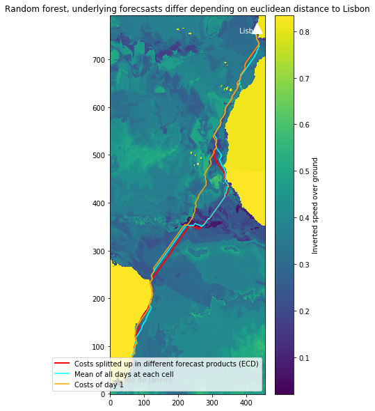

# Group Challenge
Contributors:

* Alba Vilanova Cortezón (https://github.com/albavilanova)
* Jannis Fröhlking (https://github.com/JaFro96)
* Jonathan Bahlmann (https://github.com/jonathom)

# Data collection


```python
# Imports 

import requests
import zipfile
import os
import pandas as pd
import ftplib
import os
from getpass import getpass
import xarray as xr
import numpy as np
```

## STEP 1: Collect data

AIS and CMEMS data for the model on:

* 01.01.2020
* 01.04.2020
* 01.07.2020
* 01.10.2020

CMEMS data for the routing on:
* 01.06.2021
* 02.06.2021
* 03.06.2021

### Model data - AIS


```python
# Download data

# Set file path
urls = ['https://coast.noaa.gov/htdata/CMSP/AISDataHandler/2020/AIS_2020_01_01.zip',
'https://coast.noaa.gov/htdata/CMSP/AISDataHandler/2020/AIS_2020_04_01.zip',
'https://coast.noaa.gov/htdata/CMSP/AISDataHandler/2020/AIS_2020_07_01.zip',
'https://coast.noaa.gov/htdata/CMSP/AISDataHandler/2020/AIS_2020_10_01.zip']

# Unzip data
for url in urls:

  r = requests.get(url)
  filename = url.split('/')[-1]
  with open(filename,'wb') as output_file:
      output_file.write(r.content)
  print(filename)

  try:
      with zipfile.ZipFile(filename) as z:
          z.extractall()
          print("Extracted file")
          os.remove(filename)
  except:
      print("Invalid file")

print("Download completed!")
```


```python
# Read csv and create df
ais_data = pd.DataFrame()

for url in urls:

  filename = url.split('/')[-1]
  filename = filename.replace("zip", "csv")
  data = pd.read_csv('data/' + filename)
  ais_data = ais_data.append(data)
  
print("Before preprocessing...")
ais_data = ais_data.reset_index(drop = True)
ais_data
```


```python
# Save AIS data to file
ais_data.to_csv('data/ais_data_all.csv')
```

### Model data - CMEMS
Downloading the data for the 4 days. [DATASETS](https://resources.marine.copernicus.eu/?option=com_csw&task=results)


```python
# Connect to CMEMS FTP

name = 'avilanovacortez'
pwd = 'CMEMS-data-2021'
"""
name = getpass('Enter name: ')
pwd = getpass('Enter pwd: ')
"""

def make_con(url):

    con = ftplib.FTP(url)
    print(con.getwelcome())

    return con

con = make_con('nrt.cmems-du.eu')
```

    220 Welcome to CMEMS FTP service
    


```python
# Print available data

wav_url = '/Core/GLOBAL_ANALYSIS_FORECAST_WAV_001_027/global-analysis-forecast-wav-001-027/2020/' # 3-hourly
phy_url = '/Core/GLOBAL_ANALYSIS_FORECAST_PHY_001_024/global-analysis-forecast-phy-001-024/2020/' # 24-hourly

def print_collection(url, con):

  try:

    con.login(name, pwd)
    # Navigate to a wave forecast product
    con.cwd(url)
    # Retrieve as list
    con.retrlines('LIST') 
    
  except ftplib.all_errors as e:
    print('FTP error:', e)

#print_collection(wav_url + '07', con) # Print content for July
```


```python
# Download data 

wav_url = '/Core/GLOBAL_ANALYSIS_FORECAST_WAV_001_027/global-analysis-forecast-wav-001-027/2020/' # 3-hourly
phy_url = '/Core/GLOBAL_ANALYSIS_FORECAST_PHY_001_024/global-analysis-forecast-phy-001-024/2020/' # 24-hourly

wav_jan = "mfwamglocep_2020010100_R20200102.nc"
wav_apr = "mfwamglocep_2020040100_R20200402.nc"
wav_jul = "mfwamglocep_2020070100_R20200702.nc"
wav_oct = "mfwamglocep_2020100100_R20201002.nc"

phy_jan = "mercatorpsy4v3r1_gl12_mean_20200101_R20200115.nc"
phy_apr = "mercatorpsy4v3r1_gl12_mean_20200401_R20200415.nc"
phy_jul = "mercatorpsy4v3r1_gl12_mean_20200701_R20200715.nc"
phy_oct = "mercatorpsy4v3r1_gl12_mean_20201001_R20201014.nc"

def download_ftp(url, prod_name):
  # Check if file exists, taken from source at the top
  if os.path.isfile(prod_name):
    print("There is already a local copy of {}".format(prod_name))

  else:
    try:

      con.login(name, pwd)
      con.cwd(url)

      with open(prod_name, 'wb') as fp:
        con.retrbinary('RETR {}'.format(prod_name), fp.write)
            
    except ftplib.all_errors as e:
      print('FTP error:', e)

"""
# Use this to download data 
download_ftp(wav_url + '01', wav_jan)
download_ftp(wav_url + '04', wav_apr)
download_ftp(wav_url + '07', wav_jul)
download_ftp(wav_url + '10', wav_oct)

download_ftp(phy_url + '01', phy_jan)
download_ftp(phy_url + '04', phy_apr)
download_ftp(phy_url + '07', phy_jul)
download_ftp(phy_url + '10', phy_oct)
"""
```


    "\n# Use this to download data \ndownload_ftp(wav_url + '01', wav_jan)\ndownload_ftp(wav_url + '04', wav_apr)\ndownload_ftp(wav_url + '07', wav_jul)\ndownload_ftp(wav_url + '10', wav_oct)\n\ndownload_ftp(phy_url + '01', phy_jan)\ndownload_ftp(phy_url + '04', phy_apr)\ndownload_ftp(phy_url + '07', phy_jul)\ndownload_ftp(phy_url + '10', phy_oct)\n"


```python
"""
# OPTIONAL: Reduce CMEMS waves data size by using bbox

# Between Rio de Janeiro and Lisboa
# bbox = ((-9, 22), (-46, 38))

def get_closest(array, value):
    return np.abs(array - value).argmin()
    
ds_wav_jan = xr.open_dataset('data/' + wav_jan)
ds_wav_apr = xr.open_dataset('data/' + wav_apr)
ds_wav_jul = xr.open_dataset('data/' + wav_jul)
ds_wav_oct = xr.open_dataset('data/' + wav_oct)

ds_wav_all = [ds_wav_jan, ds_wav_apr, ds_wav_jul, ds_wav_oct]

datasets_wav = []

for ds_month in ds_wav_all:
  
  lon_min = get_closest(ds_month.longitude.data, bbox[0][0])
  lon_max = get_closest(ds_month.longitude.data, bbox[1][0])
  lat_min = get_closest(ds_month.latitude.data, bbox[0][1])
  lat_max = get_closest(ds_month.latitude.data, bbox[1][1])

  ds_wav_month_reg = ds_month.isel(time = 0, longitude = slice(lon_min, lon_max), latitude = slice(lat_min, lat_max))
  datasets_wav.append(ds_wav_month_reg)

ds_wav = xr.concat(datasets_wav, dim = 'time')
ds_wav
"""
```


```python
"""
# OPTIONAL: Reduce CMEMS physics data size by using bbox

ds_phy_jan = xr.open_dataset('data/' + phy_jan)
ds_phy_apr = xr.open_dataset('data/' + phy_apr)
ds_phy_jul = xr.open_dataset('data/' + phy_jul)
ds_phy_oct = xr.open_dataset('data/' + phy_oct)

ds_phy_all = [ds_phy_jan, ds_phy_apr, ds_phy_jul, ds_phy_oct]

datasets_phy = []

for ds_month in ds_phy_all:
  
  lon_min = get_closest(ds_month.longitude.data, bbox[0][0])
  lon_max = get_closest(ds_month.longitude.data, bbox[1][0])
  lat_min = get_closest(ds_month.latitude.data, bbox[0][1])
  lat_max = get_closest(ds_month.latitude.data, bbox[1][1])

  ds_phy_month_reg = ds_month.isel(time = 0, longitude = slice(lon_min, lon_max), latitude = slice(lat_min, lat_max))
  datasets_phy.append(ds_phy_month_reg)

ds_phy = xr.concat(datasets_phy, dim = 'time')
ds_phy
"""
```


```python
# Join all wave products by using open_mfdataset, chunking data in response to memory issues
ds_wav_all = xr.open_mfdataset('data/mfwamglocep*.nc')
ds_wav_all
```


```python
ds_phy_all = xr.open_mfdataset('data/mercator*.nc')
ds_phy_all
```

### Routing data - CMEMS


```python
# Print available data
wav_url = '/Core/GLOBAL_ANALYSIS_FORECAST_WAV_001_027/global-analysis-forecast-wav-001-027/2021/' 
phy_url = '/Core/GLOBAL_ANALYSIS_FORECAST_PHY_001_024/global-analysis-forecast-phy-001-024/2021/' 

def print_collection(url, con):

  try:
   
    con.login(name, pwd)
    con.cwd(url)
    con.retrlines('LIST') 
    
  except ftplib.all_errors as e:
    print('FTP error:', e)

print_collection(wav_url + '06', con)
```


```python
wav_2021_06_01 = "mfwamglocep_2021060100_R20210602.nc"
wav_2021_06_02 = "mfwamglocep_2021060200_R20210603.nc"
wav_2021_06_03 = "mfwamglocep_2021060300_R20210604.nc"

phy_2021_06_01 = "mercatorpsy4v3r1_gl12_mean_20210601_R20210609.nc"
phy_2021_06_02 = "mercatorpsy4v3r1_gl12_mean_20210602_R20210616.nc"
phy_2021_06_03 = "mercatorpsy4v3r1_gl12_mean_20210603_R20210616.nc"

download_ftp(wav_url + '06', wav_2021_06_01)
download_ftp(wav_url + '06', wav_2021_06_02)
download_ftp(wav_url + '06', wav_2021_06_03)

download_ftp(phy_url + '06', phy_2021_06_01)
download_ftp(phy_url + '06', phy_2021_06_02)
download_ftp(phy_url + '06', phy_2021_06_03)
```


```python
ds_phy_all_2021 = xr.open_mfdataset('data/routing/mercator*.nc')
ds_phy_all_2021
```

## STEP 2: Merge and preprocess model data
In general:
* Merge AIS data with CMEMS data
* Remove unneccessary columns (show estimated time, latitude, longitude, heading, SOG, COG, Gross Tonage, VHM0, VMDR, Temperature and Salinity)

For CMEMS Data:
* Normalize data and remove its outliers

For AIS Data:
* Remove ships with Status =! 0 or Status =! 8
* Remove ships with SOG < 7 or SOG > 102.2
* Remove ships with latitude > 91 and longitude > 181
* Remove ships with latitude < -91 and longitude < -181
* Remove ships with heading > 361
* WRONG? Calculate Gross Tonnage
* Estimate data base times
* Normalize data (SOG) and remove its outliers


```python
study_data = pd.read_csv('data/ais_data_all.csv')
```


```python
# Remove ships with status =! 0 and status =! 8
study_data = study_data[(study_data['Status'] == 0) | (study_data['Status'] == 8)].dropna()

# Remove ships with SOG < 5 or SOG > 102.2
study_data = study_data[(study_data['SOG'] > 7) & (study_data['SOG'] < 102.2)].dropna()

# Remove ships with latitude > 91 and longitude > 181
study_data = study_data[(study_data['LAT'] < 91) & (study_data['LAT'] > -91)].dropna()
study_data = study_data[(study_data['LON'] < 181) & (study_data['LON'] > -181)].dropna()

# Remove ships with heading > 361
study_data = study_data[(study_data['Heading'] < 361)].dropna()

# Calculate tonnage (Length * Breadth * Depth * S) - WE DON'T HAVE THE DEPTH
# According to https://cdn.shopify.com/s/files/1/1021/8837/files/Tonnage_Guide_1_-_Simplified_Measurement.pdf?1513
study_data['GrossTonnage'] = 0.67 * study_data['Length'] * study_data['Width']

study_data = study_data.reset_index(drop=True)
study_data
```


<div>
<style scoped>
    .dataframe tbody tr th:only-of-type {
        vertical-align: middle;
    }

    .dataframe tbody tr th {
        vertical-align: top;
    }

    .dataframe thead th {
        text-align: right;
    }
</style>
<table border="1" class="dataframe">
  <thead>
    <tr style="text-align: right;">
      <th></th>
      <th>Unnamed: 0</th>
      <th>MMSI</th>
      <th>BaseDateTime</th>
      <th>LAT</th>
      <th>LON</th>
      <th>SOG</th>
      <th>COG</th>
      <th>Heading</th>
      <th>VesselName</th>
      <th>IMO</th>
      <th>CallSign</th>
      <th>VesselType</th>
      <th>Status</th>
      <th>Length</th>
      <th>Width</th>
      <th>Draft</th>
      <th>Cargo</th>
      <th>TranscieverClass</th>
      <th>GrossTonnage</th>
    </tr>
  </thead>
  <tbody>
    <tr>
      <th>0</th>
      <td>9</td>
      <td>477628100</td>
      <td>2020-01-01T00:00:01</td>
      <td>36.80096</td>
      <td>-75.22302</td>
      <td>12.8</td>
      <td>-128.7</td>
      <td>283.0</td>
      <td>NINGBO SEAL</td>
      <td>IMO9579066</td>
      <td>VRJD3</td>
      <td>70.0</td>
      <td>0.0</td>
      <td>225.0</td>
      <td>32.0</td>
      <td>14.3</td>
      <td>70.0</td>
      <td>B</td>
      <td>4824.00</td>
    </tr>
    <tr>
      <th>1</th>
      <td>17</td>
      <td>538002845</td>
      <td>2020-01-01T00:00:10</td>
      <td>26.08420</td>
      <td>-79.48273</td>
      <td>13.2</td>
      <td>189.0</td>
      <td>187.0</td>
      <td>YASA GOLDEN DARDANEL</td>
      <td>IMO9339985</td>
      <td>V7ME9</td>
      <td>80.0</td>
      <td>0.0</td>
      <td>245.0</td>
      <td>42.0</td>
      <td>15.0</td>
      <td>89.0</td>
      <td>B</td>
      <td>6894.30</td>
    </tr>
    <tr>
      <th>2</th>
      <td>50</td>
      <td>249974000</td>
      <td>2020-01-01T00:00:06</td>
      <td>29.34368</td>
      <td>-94.74366</td>
      <td>10.2</td>
      <td>85.7</td>
      <td>86.0</td>
      <td>PTI RHINE</td>
      <td>IMO9313462</td>
      <td>9HA4456</td>
      <td>80.0</td>
      <td>0.0</td>
      <td>183.0</td>
      <td>32.0</td>
      <td>13.2</td>
      <td>81.0</td>
      <td>B</td>
      <td>3923.52</td>
    </tr>
    <tr>
      <th>3</th>
      <td>55</td>
      <td>477542400</td>
      <td>2020-01-01T00:00:01</td>
      <td>37.76973</td>
      <td>-122.35415</td>
      <td>10.6</td>
      <td>-87.5</td>
      <td>326.0</td>
      <td>ATLANTIC PISCES</td>
      <td>IMO9392781</td>
      <td>VRFN3</td>
      <td>80.0</td>
      <td>0.0</td>
      <td>183.0</td>
      <td>32.0</td>
      <td>12.2</td>
      <td>80.0</td>
      <td>B</td>
      <td>3923.52</td>
    </tr>
    <tr>
      <th>4</th>
      <td>69</td>
      <td>636016431</td>
      <td>2020-01-01T00:00:10</td>
      <td>26.89363</td>
      <td>-79.20262</td>
      <td>19.7</td>
      <td>154.9</td>
      <td>155.0</td>
      <td>MSC VAISHNAVI R</td>
      <td>IMO9227340</td>
      <td>A8RL2</td>
      <td>70.0</td>
      <td>0.0</td>
      <td>282.0</td>
      <td>32.0</td>
      <td>12.5</td>
      <td>71.0</td>
      <td>B</td>
      <td>6046.08</td>
    </tr>
    <tr>
      <th>...</th>
      <td>...</td>
      <td>...</td>
      <td>...</td>
      <td>...</td>
      <td>...</td>
      <td>...</td>
      <td>...</td>
      <td>...</td>
      <td>...</td>
      <td>...</td>
      <td>...</td>
      <td>...</td>
      <td>...</td>
      <td>...</td>
      <td>...</td>
      <td>...</td>
      <td>...</td>
      <td>...</td>
      <td>...</td>
    </tr>
    <tr>
      <th>720152</th>
      <td>30502227</td>
      <td>441310000</td>
      <td>2020-10-01T23:59:34</td>
      <td>26.05327</td>
      <td>-79.84955</td>
      <td>19.7</td>
      <td>4.2</td>
      <td>5.0</td>
      <td>GLOVIS SOLOMON</td>
      <td>IMO9445409</td>
      <td>D7GS</td>
      <td>70.0</td>
      <td>0.0</td>
      <td>232.0</td>
      <td>32.0</td>
      <td>9.4</td>
      <td>70.0</td>
      <td>B</td>
      <td>4974.08</td>
    </tr>
    <tr>
      <th>720153</th>
      <td>30502254</td>
      <td>636013708</td>
      <td>2020-10-01T23:58:58</td>
      <td>28.44555</td>
      <td>-95.59912</td>
      <td>12.9</td>
      <td>56.0</td>
      <td>57.0</td>
      <td>NEW ACTIVITY</td>
      <td>IMO9361524</td>
      <td>A8OU2</td>
      <td>80.0</td>
      <td>0.0</td>
      <td>228.0</td>
      <td>42.0</td>
      <td>14.8</td>
      <td>80.0</td>
      <td>B</td>
      <td>6415.92</td>
    </tr>
    <tr>
      <th>720154</th>
      <td>30502305</td>
      <td>218092000</td>
      <td>2020-10-01T23:59:36</td>
      <td>39.18945</td>
      <td>-130.91286</td>
      <td>19.9</td>
      <td>-129.6</td>
      <td>280.0</td>
      <td>HANOVER EXPRESS</td>
      <td>IMO9343716</td>
      <td>DFGX2</td>
      <td>70.0</td>
      <td>0.0</td>
      <td>336.0</td>
      <td>42.0</td>
      <td>14.6</td>
      <td>79.0</td>
      <td>B</td>
      <td>9455.04</td>
    </tr>
    <tr>
      <th>720155</th>
      <td>30502324</td>
      <td>636017617</td>
      <td>2020-10-01T23:57:40</td>
      <td>17.18697</td>
      <td>-67.33857</td>
      <td>11.7</td>
      <td>110.0</td>
      <td>110.0</td>
      <td>NORDIC STAVANGER</td>
      <td>IMO9514377</td>
      <td>D5LX3</td>
      <td>70.0</td>
      <td>0.0</td>
      <td>189.0</td>
      <td>32.0</td>
      <td>12.7</td>
      <td>70.0</td>
      <td>B</td>
      <td>4052.16</td>
    </tr>
    <tr>
      <th>720156</th>
      <td>30502456</td>
      <td>636015168</td>
      <td>2020-10-01T23:54:41</td>
      <td>37.51332</td>
      <td>-68.00148</td>
      <td>10.9</td>
      <td>77.4</td>
      <td>62.0</td>
      <td>AQUAFORTUNE</td>
      <td>IMO9426427</td>
      <td>A8ZA6</td>
      <td>70.0</td>
      <td>0.0</td>
      <td>289.0</td>
      <td>45.0</td>
      <td>18.0</td>
      <td>71.0</td>
      <td>B</td>
      <td>8713.35</td>
    </tr>
  </tbody>
</table>
<p>720157 rows × 19 columns</p>
</div>


```python
from datetime import datetime, timedelta

# Round the base date time
study_data['BaseDateTime'] = study_data['BaseDateTime'].apply(lambda x: datetime.fromisoformat(x))

def datetime_rounder(time):
    return (time.replace(second = 0, minute = 0, hour = time.hour) + timedelta(hours = time.minute//30))

study_data['EstimatedTime'] = [datetime_rounder(study_data['BaseDateTime'][x]) for x in range(study_data['BaseDateTime'].size)]
study_data['EstimatedTime'] = pd.to_datetime(study_data['EstimatedTime']).dt.strftime('%y-%m-%d %h:%I:%s')
#study_data['EstimatedTime'] = [np.datetime64(study_data['EstimatedTime'][x]) for x in range(study_data['EstimatedTime'].size)]

study_data
```


<div>
<style scoped>
    .dataframe tbody tr th:only-of-type {
        vertical-align: middle;
    }

    .dataframe tbody tr th {
        vertical-align: top;
    }

    .dataframe thead th {
        text-align: right;
    }
</style>
<table border="1" class="dataframe">
  <thead>
    <tr style="text-align: right;">
      <th></th>
      <th>Unnamed: 0</th>
      <th>MMSI</th>
      <th>BaseDateTime</th>
      <th>LAT</th>
      <th>LON</th>
      <th>SOG</th>
      <th>COG</th>
      <th>Heading</th>
      <th>VesselName</th>
      <th>IMO</th>
      <th>CallSign</th>
      <th>VesselType</th>
      <th>Status</th>
      <th>Length</th>
      <th>Width</th>
      <th>Draft</th>
      <th>Cargo</th>
      <th>TranscieverClass</th>
      <th>GrossTonnage</th>
      <th>EstimatedTime</th>
    </tr>
  </thead>
  <tbody>
    <tr>
      <th>0</th>
      <td>9</td>
      <td>477628100</td>
      <td>2020-01-01 00:00:01</td>
      <td>36.80096</td>
      <td>-75.22302</td>
      <td>12.8</td>
      <td>-128.7</td>
      <td>283.0</td>
      <td>NINGBO SEAL</td>
      <td>IMO9579066</td>
      <td>VRJD3</td>
      <td>70.0</td>
      <td>0.0</td>
      <td>225.0</td>
      <td>32.0</td>
      <td>14.3</td>
      <td>70.0</td>
      <td>B</td>
      <td>4824.00</td>
      <td>2020-01-01 00:00:00</td>
    </tr>
    <tr>
      <th>1</th>
      <td>17</td>
      <td>538002845</td>
      <td>2020-01-01 00:00:10</td>
      <td>26.08420</td>
      <td>-79.48273</td>
      <td>13.2</td>
      <td>189.0</td>
      <td>187.0</td>
      <td>YASA GOLDEN DARDANEL</td>
      <td>IMO9339985</td>
      <td>V7ME9</td>
      <td>80.0</td>
      <td>0.0</td>
      <td>245.0</td>
      <td>42.0</td>
      <td>15.0</td>
      <td>89.0</td>
      <td>B</td>
      <td>6894.30</td>
      <td>2020-01-01 00:00:00</td>
    </tr>
    <tr>
      <th>2</th>
      <td>50</td>
      <td>249974000</td>
      <td>2020-01-01 00:00:06</td>
      <td>29.34368</td>
      <td>-94.74366</td>
      <td>10.2</td>
      <td>85.7</td>
      <td>86.0</td>
      <td>PTI RHINE</td>
      <td>IMO9313462</td>
      <td>9HA4456</td>
      <td>80.0</td>
      <td>0.0</td>
      <td>183.0</td>
      <td>32.0</td>
      <td>13.2</td>
      <td>81.0</td>
      <td>B</td>
      <td>3923.52</td>
      <td>2020-01-01 00:00:00</td>
    </tr>
    <tr>
      <th>3</th>
      <td>55</td>
      <td>477542400</td>
      <td>2020-01-01 00:00:01</td>
      <td>37.76973</td>
      <td>-122.35415</td>
      <td>10.6</td>
      <td>-87.5</td>
      <td>326.0</td>
      <td>ATLANTIC PISCES</td>
      <td>IMO9392781</td>
      <td>VRFN3</td>
      <td>80.0</td>
      <td>0.0</td>
      <td>183.0</td>
      <td>32.0</td>
      <td>12.2</td>
      <td>80.0</td>
      <td>B</td>
      <td>3923.52</td>
      <td>2020-01-01 00:00:00</td>
    </tr>
    <tr>
      <th>4</th>
      <td>69</td>
      <td>636016431</td>
      <td>2020-01-01 00:00:10</td>
      <td>26.89363</td>
      <td>-79.20262</td>
      <td>19.7</td>
      <td>154.9</td>
      <td>155.0</td>
      <td>MSC VAISHNAVI R</td>
      <td>IMO9227340</td>
      <td>A8RL2</td>
      <td>70.0</td>
      <td>0.0</td>
      <td>282.0</td>
      <td>32.0</td>
      <td>12.5</td>
      <td>71.0</td>
      <td>B</td>
      <td>6046.08</td>
      <td>2020-01-01 00:00:00</td>
    </tr>
    <tr>
      <th>...</th>
      <td>...</td>
      <td>...</td>
      <td>...</td>
      <td>...</td>
      <td>...</td>
      <td>...</td>
      <td>...</td>
      <td>...</td>
      <td>...</td>
      <td>...</td>
      <td>...</td>
      <td>...</td>
      <td>...</td>
      <td>...</td>
      <td>...</td>
      <td>...</td>
      <td>...</td>
      <td>...</td>
      <td>...</td>
      <td>...</td>
    </tr>
    <tr>
      <th>720152</th>
      <td>30502227</td>
      <td>441310000</td>
      <td>2020-10-01 23:59:34</td>
      <td>26.05327</td>
      <td>-79.84955</td>
      <td>19.7</td>
      <td>4.2</td>
      <td>5.0</td>
      <td>GLOVIS SOLOMON</td>
      <td>IMO9445409</td>
      <td>D7GS</td>
      <td>70.0</td>
      <td>0.0</td>
      <td>232.0</td>
      <td>32.0</td>
      <td>9.4</td>
      <td>70.0</td>
      <td>B</td>
      <td>4974.08</td>
      <td>2020-10-02 00:00:00</td>
    </tr>
    <tr>
      <th>720153</th>
      <td>30502254</td>
      <td>636013708</td>
      <td>2020-10-01 23:58:58</td>
      <td>28.44555</td>
      <td>-95.59912</td>
      <td>12.9</td>
      <td>56.0</td>
      <td>57.0</td>
      <td>NEW ACTIVITY</td>
      <td>IMO9361524</td>
      <td>A8OU2</td>
      <td>80.0</td>
      <td>0.0</td>
      <td>228.0</td>
      <td>42.0</td>
      <td>14.8</td>
      <td>80.0</td>
      <td>B</td>
      <td>6415.92</td>
      <td>2020-10-02 00:00:00</td>
    </tr>
    <tr>
      <th>720154</th>
      <td>30502305</td>
      <td>218092000</td>
      <td>2020-10-01 23:59:36</td>
      <td>39.18945</td>
      <td>-130.91286</td>
      <td>19.9</td>
      <td>-129.6</td>
      <td>280.0</td>
      <td>HANOVER EXPRESS</td>
      <td>IMO9343716</td>
      <td>DFGX2</td>
      <td>70.0</td>
      <td>0.0</td>
      <td>336.0</td>
      <td>42.0</td>
      <td>14.6</td>
      <td>79.0</td>
      <td>B</td>
      <td>9455.04</td>
      <td>2020-10-02 00:00:00</td>
    </tr>
    <tr>
      <th>720155</th>
      <td>30502324</td>
      <td>636017617</td>
      <td>2020-10-01 23:57:40</td>
      <td>17.18697</td>
      <td>-67.33857</td>
      <td>11.7</td>
      <td>110.0</td>
      <td>110.0</td>
      <td>NORDIC STAVANGER</td>
      <td>IMO9514377</td>
      <td>D5LX3</td>
      <td>70.0</td>
      <td>0.0</td>
      <td>189.0</td>
      <td>32.0</td>
      <td>12.7</td>
      <td>70.0</td>
      <td>B</td>
      <td>4052.16</td>
      <td>2020-10-02 00:00:00</td>
    </tr>
    <tr>
      <th>720156</th>
      <td>30502456</td>
      <td>636015168</td>
      <td>2020-10-01 23:54:41</td>
      <td>37.51332</td>
      <td>-68.00148</td>
      <td>10.9</td>
      <td>77.4</td>
      <td>62.0</td>
      <td>AQUAFORTUNE</td>
      <td>IMO9426427</td>
      <td>A8ZA6</td>
      <td>70.0</td>
      <td>0.0</td>
      <td>289.0</td>
      <td>45.0</td>
      <td>18.0</td>
      <td>71.0</td>
      <td>B</td>
      <td>8713.35</td>
      <td>2020-10-02 00:00:00</td>
    </tr>
  </tbody>
</table>
<p>720157 rows × 20 columns</p>
</div>


```python
# Get data for one time
ds_wav = ds_wav_all
ds_phy = ds_phy_all
lat = round(study_data['LAT'].iloc[0])
lon = round(study_data['LON'].iloc[0])
time = str(study_data['EstimatedTime'].iloc[0])

VHM0 = ds_wav.VHM0.sel(time = time, longitude = lon, latitude = lat, method = 'nearest')
VMDR = ds_wav.VMDR.sel(time = time, longitude = lon, latitude = lat, method = 'nearest')
thetao = ds_phy.thetao.sel(time = time, longitude = lon, latitude = lat, depth = 0, method = 'nearest')
salin = ds_phy.so.sel(time = time, longitude = lon, latitude = lat, depth = 0, method = 'nearest')
```


```python
# Merge AIS and CMEMS data
study_data = study_data.dropna()

study_data['VHM0'] = 0.0
study_data['VMDR'] = 0.0
study_data['Temperature'] = 0.0
study_data['Salinity'] = 0.0

def extract_model():
  
  for index, row in study_data.iterrows():

      lat = round(row['LAT'], 1)
      lon = round(row['LON'], 1)
      time = str(row['EstimatedTime'])

      VHM0 = ds_wav.VHM0.sel(time = time, longitude = lon, latitude = lat, method = 'nearest')
      VMDR = ds_wav.VMDR.sel(time = time, longitude = lon, latitude = lat, method = 'nearest')
      thetao = ds_phy.thetao.sel(time = time, longitude = lon, latitude = lat, depth = 0, method = 'nearest')
      salin = ds_phy.so.sel(time = time, longitude = lon, latitude = lat, depth = 0, method = 'nearest')

      study_data.at[index, 'VHM0'] = VHM0
      study_data.at[index, 'VMDR'] = VMDR
      study_data.at[index, 'Temperature'] = thetao
      study_data.at[index, 'Salinity'] = salin
      
extract_model()

study_data = study_data.dropna()
study_data
```


```python
# Save merge data (not fully processed)
study_data.to_csv('data/study_data_np.csv')
```


```python
study_data = pd.read_csv('data/study_data_np.csv')
```


```python
import matplotlib.pyplot as plt

# Normalize SOG
study_data['SOG_norm'] = (study_data['SOG'] - study_data['SOG'].mean(axis = 0)) / study_data['SOG'].std(axis = 0)

# Make histogram of normalized SOG
study_data['SOG_norm'].plot(kind = 'hist', alpha = 0.7, bins = 30, title = 'Histogram of normalized SOG', 
                            grid = True, figsize = (10,5), fontsize = 14, color = ['#C40000'])
plt.xlabel('Normalized SOG', fontsize = 16)
plt.ylabel("Frequency", fontsize = 16)
plt.show()

# Remove SOG outliers
study_data = study_data[(study_data['SOG_norm'] < 4)].dropna()

# Standardize to 0 to 1
study_data['SOG_norm'] = ((study_data['SOG_norm'] - study_data['SOG_norm'].min(axis=0)) / 
                           (study_data['SOG_norm'].max(axis = 0) - study_data['SOG_norm'].min(axis=0)))
```


```python
# Normalize COG
study_data['COG_norm'] = (study_data['COG'] - study_data['COG'].mean(axis = 0)) / study_data['COG'].std(axis = 0)

# Make histogram of normalized COG
study_data['COG_norm'].plot(kind = 'hist', alpha = 0.7, bins = 30, title = 'Histogram of normalized COG', 
                            grid = True, figsize = (10,5), fontsize = 14, color = ['#C40000'])
plt.xlabel('Normalized COG', fontsize = 16)
plt.ylabel("Frequency", fontsize = 16)
plt.show()

# Standardize to 0 to 1
study_data['COG_norm'] = ((study_data['COG_norm'] - study_data['COG_norm'].min(axis=0)) / 
                           (study_data['COG_norm'].max(axis = 0) - study_data['COG_norm'].min(axis=0)))
```


```python
# Normalize Gross Tonnage
study_data['GrossTonnage_norm'] = (study_data['GrossTonnage'] - study_data['GrossTonnage'].mean(axis = 0)) / study_data['GrossTonnage'].std(axis = 0)

# Make histogram of normalized Gross Tonnage
study_data['GrossTonnage_norm'].plot(kind = 'hist', alpha = 0.7, bins = 30, title = 'Histogram of normalized Gross Tonnage', 
                            grid = True, figsize = (10,5), fontsize = 14, color = ['#C40000'])
plt.xlabel('Normalized Gross Tonnage', fontsize = 16)
plt.ylabel("Frequency", fontsize = 16)
plt.show()

# Standardize to 0 to 1
study_data['GrossTonnage_norm'] = ((study_data['GrossTonnage_norm'] - study_data['GrossTonnage_norm'].min(axis=0)) / 
                                    (study_data['GrossTonnage_norm'].max(axis = 0) - study_data['GrossTonnage_norm'].min(axis=0)))
```


```python
# Normalize VHM0
study_data['VHM0_norm'] = (study_data['VHM0'] - study_data['VHM0'].mean(axis = 0)) / study_data['VHM0'].std(axis = 0)

# Make histogram of normalized VHM0
study_data['VHM0_norm'].plot(kind = 'hist', alpha = 0.7, bins = 30, title = 'Histogram of normalized VHM0', 
                            grid = True, figsize = (10,5), fontsize = 14, color = ['#C40000'])
plt.xlabel('Normalized VHM0', fontsize = 16)
plt.ylabel("Frequency", fontsize = 16)
plt.show()

# Remove VHM0 outliers
study_data = study_data[(study_data['VHM0_norm'] > -2)].dropna()

# Standardize to 0 to 1
study_data['VHM0_norm'] = ((study_data['VHM0_norm'] - study_data['VHM0_norm'].min(axis=0)) / 
                            (study_data['VHM0_norm'].max(axis = 0) - study_data['VHM0_norm'].min(axis=0)))
```


```python
# Normalize VMDR
study_data['VMDR_norm'] = (study_data['VMDR'] - study_data['VMDR'].mean(axis = 0)) / study_data['VMDR'].std(axis = 0)

# Make histogram of normalized VMDR
study_data['VMDR_norm'].plot(kind = 'hist', alpha = 0.7, bins = 30, title = 'Histogram of normalized VMDR', 
                            grid = True, figsize = (10,5), fontsize = 14, color = ['#C40000'])
plt.xlabel('Normalized VMDR', fontsize = 16)
plt.ylabel("Frequency", fontsize = 16)
plt.show()

# Standardize to 0 to 1
study_data['VMDR_norm'] = ((study_data['VMDR_norm'] - study_data['VMDR_norm'].min(axis=0)) / 
                            (study_data['VMDR_norm'].max(axis = 0) - study_data['VMDR_norm'].min(axis=0)))
```


```python
# Normalize Temperature
study_data['Temperature_norm'] = (study_data['Temperature'] - study_data['Temperature'].mean(axis = 0)) / study_data['Temperature'].std(axis = 0)

# Make histogram of normalized Temperature
study_data['Temperature_norm'].plot(kind = 'hist', alpha = 0.7, bins = 30, title = 'Histogram of normalized Temperature', 
                            grid = True, figsize = (10,5), fontsize = 14, color = ['#C40000'])
plt.xlabel('Normalized Temperature', fontsize = 16)
plt.ylabel("Frequency", fontsize = 16)
plt.show()

# Standardize to 0 to 1
study_data['Temperature_norm'] = ((study_data['Temperature_norm'] - study_data['Temperature_norm'].min(axis=0)) / 
                                   (study_data['Temperature_norm'].max(axis = 0) - study_data['Temperature_norm'].min(axis=0)))
```


```python
# Normalize Salinity
study_data['Salinity_norm'] = (study_data['Salinity'] - study_data['Salinity'].mean(axis = 0)) / study_data['Salinity'].std(axis = 0)

# Make histogram of normalized Salinity
study_data['Salinity_norm'].plot(kind = 'hist', alpha = 0.7, bins = 30, title = 'Histogram of normalized Salinity', 
                            grid = True, figsize = (10,5), fontsize = 14, color = ['#C40000'])
plt.xlabel('Normalized Salinity', fontsize = 16)
plt.ylabel("Frequency", fontsize = 16)
plt.show()

# Standardize to 0 to 1
study_data['Salinity_norm'] = ((study_data['Salinity_norm'] - study_data['Salinity_norm'].min(axis=0)) / 
                               (study_data['Salinity_norm'].max(axis=0) - study_data['Salinity_norm'].min(axis=0)))
```


```python
print("After preprocessing...")
final_data = study_data.filter(['EstimatedTime', 'LAT', 'LON', 'Heading', 'SOG_norm', 'COG_norm', 'GrossTonnage_norm', 'VHM0_norm', 'VMDR_norm', 'Temperature_norm', 'Salinity_norm'])
final_data = final_data.dropna()
final_data.to_csv('data/preprocessed_data.csv')
final_data
```

    After preprocessing...
    


<div>
<style scoped>
    .dataframe tbody tr th:only-of-type {
        vertical-align: middle;
    }

    .dataframe tbody tr th {
        vertical-align: top;
    }

    .dataframe thead th {
        text-align: right;
    }
</style>
<table border="1" class="dataframe">
  <thead>
    <tr style="text-align: right;">
      <th></th>
      <th>EstimatedTime</th>
      <th>LAT</th>
      <th>LON</th>
      <th>Heading</th>
      <th>SOG_norm</th>
      <th>COG_norm</th>
      <th>GrossTonnage_norm</th>
      <th>VHM0_norm</th>
      <th>VMDR_norm</th>
      <th>Temperature_norm</th>
      <th>Salinity_norm</th>
    </tr>
  </thead>
  <tbody>
    <tr>
      <th>0</th>
      <td>2020-01-01 00:00:00</td>
      <td>36.80096</td>
      <td>-75.22302</td>
      <td>283.0</td>
      <td>0.309783</td>
      <td>0.185836</td>
      <td>0.360360</td>
      <td>0.216849</td>
      <td>0.278556</td>
      <td>0.375870</td>
      <td>0.887591</td>
    </tr>
    <tr>
      <th>1</th>
      <td>2020-01-01 00:00:00</td>
      <td>26.08420</td>
      <td>-79.48273</td>
      <td>187.0</td>
      <td>0.331522</td>
      <td>0.961661</td>
      <td>0.515015</td>
      <td>0.088924</td>
      <td>0.052832</td>
      <td>0.835220</td>
      <td>0.982673</td>
    </tr>
    <tr>
      <th>2</th>
      <td>2020-01-01 00:00:00</td>
      <td>29.34368</td>
      <td>-94.74366</td>
      <td>86.0</td>
      <td>0.168478</td>
      <td>0.709402</td>
      <td>0.293093</td>
      <td>0.018721</td>
      <td>0.323412</td>
      <td>0.490509</td>
      <td>0.792078</td>
    </tr>
    <tr>
      <th>3</th>
      <td>2020-01-01 00:00:00</td>
      <td>37.76973</td>
      <td>-122.35415</td>
      <td>326.0</td>
      <td>0.190217</td>
      <td>0.286447</td>
      <td>0.293093</td>
      <td>0.084243</td>
      <td>0.745706</td>
      <td>0.377345</td>
      <td>0.641309</td>
    </tr>
    <tr>
      <th>4</th>
      <td>2020-01-01 00:00:00</td>
      <td>26.89363</td>
      <td>-79.20262</td>
      <td>155.0</td>
      <td>0.684783</td>
      <td>0.878388</td>
      <td>0.451652</td>
      <td>0.092044</td>
      <td>0.022122</td>
      <td>0.808156</td>
      <td>0.987242</td>
    </tr>
    <tr>
      <th>...</th>
      <td>...</td>
      <td>...</td>
      <td>...</td>
      <td>...</td>
      <td>...</td>
      <td>...</td>
      <td>...</td>
      <td>...</td>
      <td>...</td>
      <td>...</td>
      <td>...</td>
    </tr>
    <tr>
      <th>720152</th>
      <td>2020-10-02 00:00:00</td>
      <td>26.05327</td>
      <td>-79.84955</td>
      <td>5.0</td>
      <td>0.684783</td>
      <td>0.510379</td>
      <td>0.371572</td>
      <td>0.107644</td>
      <td>0.056417</td>
      <td>0.944354</td>
      <td>0.973406</td>
    </tr>
    <tr>
      <th>720153</th>
      <td>2020-10-02 00:00:00</td>
      <td>28.44555</td>
      <td>-95.59912</td>
      <td>57.0</td>
      <td>0.315217</td>
      <td>0.636874</td>
      <td>0.479279</td>
      <td>0.037441</td>
      <td>0.305431</td>
      <td>0.861402</td>
      <td>0.840567</td>
    </tr>
    <tr>
      <th>720154</th>
      <td>2020-10-02 00:00:00</td>
      <td>39.18945</td>
      <td>-130.91286</td>
      <td>280.0</td>
      <td>0.695652</td>
      <td>0.183639</td>
      <td>0.706306</td>
      <td>0.404056</td>
      <td>0.767189</td>
      <td>0.674095</td>
      <td>0.874057</td>
    </tr>
    <tr>
      <th>720155</th>
      <td>2020-10-02 00:00:00</td>
      <td>17.18697</td>
      <td>-67.33857</td>
      <td>110.0</td>
      <td>0.250000</td>
      <td>0.768742</td>
      <td>0.302703</td>
      <td>0.371295</td>
      <td>0.258602</td>
      <td>0.934577</td>
      <td>0.935218</td>
    </tr>
    <tr>
      <th>720156</th>
      <td>2020-10-02 00:00:00</td>
      <td>37.51332</td>
      <td>-68.00148</td>
      <td>62.0</td>
      <td>0.206522</td>
      <td>0.689133</td>
      <td>0.650901</td>
      <td>0.254290</td>
      <td>0.508504</td>
      <td>0.847595</td>
      <td>0.972975</td>
    </tr>
  </tbody>
</table>
<p>566846 rows × 11 columns</p>
</div>


## Notes from meetings

**02 - 06 - 2021**

Space time cubes
- 52N: sfTracks space time cube

Simple solution:
- Start simple
- Least cost path as in simple_routing.ipynb

**09 - 06 - 2021**

Easy retrieval for cmems data: harvester.maridata EnvDataAPI github

Regarding modelling:
- Filter by ship types
- 2000 records are too low
- Have specific lengths and widths of ships
- Exclude SOG below 7 knots
- Standardization & normalization are recommended

Regarding routing:
- Genetic algorithm (Group C)
- Multi-objective optimization: pymoo - NSGA-II

# Model building


```python
# Imports 

import requests
import zipfile
import os
import pandas as pd
import ftplib
import os
import xarray as xr
import numpy as np
import matplotlib.pyplot as plt
```


```python
# load the merged and preprocessed data
data = pd.read_csv('data/preprocessed_data.csv')
```

## Simple model: linear regression


```python
from sklearn import linear_model
from sklearn.metrics import mean_squared_error, r2_score
from sklearn.model_selection import train_test_split
from sklearn.ensemble import RandomForestRegressor
```


```python
# target 
y = data.SOG_norm

# predictors
features = ['VHM0_norm','VMDR_norm','Temperature_norm','Salinity_norm'] 
X = data[features]

# split data to train and validation
train_X, val_X, train_y, val_y = train_test_split(X, y,random_state = 0)
```


```python
# Create linear regression object
regr = linear_model.LinearRegression()

# Train the model using the training sets
regr.fit(train_X, train_y)

# Make predictions using the testing set
pred_y = regr.predict(val_X)

# The coefficients
print('Coefficients: \n', regr.coef_)
# The mean squared error
print('Mean squared error: %.2f'
      % mean_squared_error(val_y, pred_y))
# R2: 1 is perfect prediction
print('R^2: %.2f'
      % r2_score(val_y, pred_y))
```

    Coefficients: 
     [0.14661334 0.04047778 0.13590311 0.08404383]
    Mean squared error: 0.03
    R^2: 0.04
    

## Intermediate model: Random forest


```python
from joblib import dump, load
from pathlib import Path

my_file = Path("data/rf_model.joblib")
if my_file.is_file():
    forest_model = load('data/rf_model.joblib') 
else:
    forest_model = RandomForestRegressor(random_state=1)
    forest_model.fit(train_X, train_y)
    pred_y = forest_model.predict(val_X)
    # The mean squared error
    print('Mean squared error: %.2f'
          % mean_squared_error(val_y, pred_y))
    # R2: 1 is perfect prediction
    print('R^2: %.2f'
          % r2_score(val_y, pred_y))
    dump(forest_model, 'data/rf_model.joblib') 

#Add variable importance
feature_importance_values = forest_model.feature_importances_
feature_importances = pd.DataFrame({'feature': features, 'importance': feature_importance_values})
```


```python
def plot_feature_importances(df):
    """Plot importances returned by a model. This can work with any measure of
    feature importance provided that higher importance is better. 
    
    Args:
        df (dataframe): feature importances. Must have the features in a column
        called `features` and the importances in a column called 'importance'
    Returns:
        shows a plot of the 15 most importance features
        
        df (dataframe): feature importances sorted by importance (highest to lowest) 
        with a column for normalized importance
        """
    
    # Sort features according to importance
    df = df.sort_values('importance', ascending = False).reset_index()
    
    # Normalize the feature importances to add up to one
    df['importance_normalized'] = df['importance'] / df['importance'].sum()

    # Make a horizontal bar chart of feature importances
    plt.figure(figsize = (10, 6))
    ax = plt.subplot()
    
    # Need to reverse the index to plot most important on top
    ax.barh(list(reversed(list(df.index[:15]))), 
            df['importance_normalized'].head(15), 
            align = 'center', edgecolor = 'k')
    
    # Set the yticks and labels
    ax.set_yticks(list(reversed(list(df.index[:15]))))
    ax.set_yticklabels(df['feature'].head(15))
    
    # Plot labeling
    plt.xlabel('Normalized Importance'); plt.title('Feature Importances')
    plt.show()
    
    return df

# Show the feature importances for the default features
feature_importances_sorted = plot_feature_importances(feature_importances)
```


# Routing


```python
# Join all wave products by using open_mfdataset, chunking data in response to memory issues
wav_all = xr.open_mfdataset('data/routing/mf*.nc')
```


```python
phy_all = xr.open_mfdataset('data/routing/me*.nc')
```

### Area of interest

Calculate the optimal shipping route between Lisbon and Rio de Janeiro avoiding high waves.

Lisbon: 38.716666° N 9.1667° W

Rio de Janeiro: 22.908333° S 43.196389° W


```python
# Get array index to the value that is closest to a given value
def get_closest(array, value):
    return np.abs(array - value).argmin()
```


```python
# Set bounding box for the allowed routing corridor
bbox = ((-45, -25),(-7, 41))
# Select time
time_slice_wav = 3
time_slice_phy = 0
```


```python
# Get indices of the bbox
lon_min = get_closest(wav_all.longitude.data, bbox[0][0])
lat_min = get_closest(wav_all.latitude.data, bbox[0][1])
lon_max = get_closest(wav_all.longitude.data, bbox[1][0])
lat_max = get_closest(wav_all.latitude.data, bbox[1][1])
```

## Define the weights

## Very simple solution: Calculate optimal route (minimum cost path) based on one variable _wave height_ for _one_ day


```python
# Extract array from dataset to define the cost in the routing algorithm 
# Wave height
wave_height = wav_all.VHM0.isel(time=time_slice_wav, longitude=slice(lon_min, lon_max), latitude=slice(lat_min, lat_max))

# Wave direction
wave_dir = wav_all.VMDR.isel(time=time_slice_wav, longitude=slice(lon_min, lon_max), latitude=slice(lat_min, lat_max))

# Temperature
temp = phy_all.thetao.isel(time=time_slice_phy, longitude=slice(lon_min, lon_max), latitude=slice(lat_min, lat_max), depth = 0)

# Salinity
sal = phy_all.so.isel(time=time_slice_phy, longitude=slice(lon_min, lon_max), latitude=slice(lat_min, lat_max), depth = 0)
```

### Start and end point of the route


```python
lat_Lis = 38.716666
lon_Lis = -9.1667
lat_Rio = -22.908333
lon_Rio = -43.196389
```


```python
start_lon = get_closest(wave_height.longitude.data, lon_Lis)
start_lat = get_closest(wave_height.latitude.data, lat_Lis)
end_lon = get_closest(wave_height.longitude.data,lon_Rio)
end_lat = get_closest(wave_height.latitude.data,lat_Rio)
```


```python
start = (start_lat, start_lon)
end = (end_lat, end_lon)
```


```python
land_mask = wave_height.data
```


```python
# mask for land areas
land_mask[np.isnan(land_mask)] = 1
```


```python
start[1]
```


    430


```python
# Plot optimal route
plt.figure(figsize=(10,10))

# Costs
plt.imshow(land_mask, aspect='auto', cmap = "RdBu")
plt.text(start[1],start[0], "Lisbon", color = "black", fontfamily="serif", fontsize = "small")
plt.text(end[1]-10,end[0]+30, "Rio de Janeiro", color = "black", fontfamily="serif", fontsize = "small")
plt.text(100, 600, "Antlantic Ocean", color = "black", fontfamily="serif", fontsize = "x-large")
plt.text(1, 200, "South America", color = "black", fontfamily="serif", fontsize = "x-large")
plt.text(380, 550, "Africa", color = "black", fontfamily="serif", fontsize = "x-large")
plt.title("Land mask")
plt.gca().invert_yaxis()
```


```python
wh_costs = wave_height.data
wd_costs = wave_dir.data
temp_costs = temp.data
sal_costs = sal.data


# Set NaN values to large wh_costs as the algorithm cannot handle NaNs
wh_costs[np.isnan(wh_costs)] = np.nanmean(wh_costs) 
wd_costs[np.isnan(wd_costs)] = np.nanmean(wd_costs) 
temp_costs[np.isnan(temp_costs)] = np.nanmean(temp_costs) 
sal_costs[np.isnan(sal_costs)] = np.nanmean(sal_costs) 
```


```python
# Standardization and normalization of weights
def stand_and_norm (x):
    # Standardization
    x_stand = (x - np.mean(x)) / np.std(x)
    # Normalization
    x_norm = (x_stand - np.min(x_stand)) / (np.max(x_stand) - np.min(x_stand))
    return x_norm

wh_costs = stand_and_norm(wh_costs)
wd_costs = stand_and_norm(wd_costs)
temp_costs = stand_and_norm(temp_costs)
sal_costs = stand_and_norm(sal_costs)
```

### Calulate costs based on linear regression model


```python
# Weight are taken from linear regression model
speed = 0.14661334*wh_costs + 0.04047778*wd_costs + 0.13590311*temp_costs + 0.08404383*sal_costs

# invert costs, because costs imitate speed 
inverted_speed = -1 * speed + np.abs(np.max(speed))

# inverted_speed[inverted_speed == 0] = 2*np.max(inverted_speed)
```


```python
# assign non-water areas high values
inverted_speed = inverted_speed.compute()
inverted_speed[land_mask ==1] = inverted_speed.max()

wh_costs[land_mask ==1] = wh_costs.max()
wd_costs[land_mask ==1] = wd_costs.max()
temp_costs[land_mask ==1] = temp_costs.max()
sal_costs[land_mask ==1] = sal_costs.max()
```


```python
from skimage.graph import route_through_array

# Calculate optimal route based on the minimum cost path

# Optional parameters:
# - fully_connected 
#     - False -> only axial moves are allowed
#     - True  -> diagonal moves are allowed
# - geometric 
#     - False -> minimum cost path
#     - True  -> distance-weighted minimum cost path

wh_indices, weight = route_through_array(wh_costs, start, end, fully_connected=True, geometric=True)
wh_indices = np.stack(wh_indices, axis=-1)

wd_indices, weight = route_through_array(wd_costs, start, end, fully_connected=True, geometric=True)
wd_indices = np.stack(wd_indices, axis=-1)

temp_indices, weight = route_through_array(temp_costs, start, end, fully_connected=True, geometric=True)
temp_indices = np.stack(temp_indices, axis=-1)

sal_indices, weight = route_through_array(sal_costs, start, end, fully_connected=True, geometric=True)
sal_indices = np.stack(sal_indices, axis=-1)

merged_indices, weight = route_through_array(inverted_speed, start, end, fully_connected=True, geometric=True)
merged_indices = np.stack(merged_indices, axis=-1)
```


```python
# Plot optimal route
plt.figure(figsize=(10,10))

# Costs
plt.imshow(inverted_speed, aspect='auto', vmin=np.min(inverted_speed), vmax=np.max(inverted_speed))

# Routes
plt.plot(wh_indices[1],wh_indices[0], 'red', label = "wave height")
plt.plot(wd_indices[1],wd_indices[0], 'grey', label = "wave direction")
plt.plot(temp_indices[1],temp_indices[0], 'orange', label = "temperature")
plt.plot(sal_indices[1],sal_indices[0], 'cyan', label = "salinity")
plt.plot(merged_indices[1],merged_indices[0], 'black', label = "wave height + wave dir + temperature + salinity")

# Start/end points
plt.plot(start_lon, start_lat, 'k^', markersize = 15)
plt.text(start_lon - 50, start_lat - 10, "Lisbon", color = "white")
plt.plot(end_lon, end_lat, 'k*', markersize=15)
plt.text(end_lon + 20, end_lat, "Rio de Janeiro", color = "white")
plt.title("Linear regression: Optimal routes (minimum cost path) from Lisbon to Rio de Janeiro")
plt.colorbar(label='Inverted speed over ground')
plt.legend(loc = "lower right")
plt.gca().invert_yaxis()
```


### Calulate costs based on random forest model


```python
# retrieve the numpy arrays
wave_height_np = wh_costs.compute()
wave_dir_np = wd_costs.compute()
wave_height_np = temp_costs.compute()
wave_height_np = sal_costs.compute()
```


```python
# reshape 2d array to dataframes to apply the random forest
wave_height_1d = pd.DataFrame(data = wh_costs.compute().ravel())
wave_dir_1d = pd.DataFrame(data = wd_costs.compute().ravel())
temp_1d = pd.DataFrame(data = temp_costs.compute().ravel())
sal_1d = pd.DataFrame(data = sal_costs.compute().ravel())

concat_costs = pd.concat([wave_height_1d,wave_dir_1d,temp_1d,sal_1d], axis = 1)
concat_costs.columns = ["Wave height","Wave direction","temperature","salinity"]

for_pred = forest_model.predict(concat_costs)
```


```python
concat_costs
```


<div>
<style scoped>
    .dataframe tbody tr th:only-of-type {
        vertical-align: middle;
    }

    .dataframe tbody tr th {
        vertical-align: top;
    }

    .dataframe thead th {
        text-align: right;
    }
</style>
<table border="1" class="dataframe">
  <thead>
    <tr style="text-align: right;">
      <th></th>
      <th>Wave height</th>
      <th>Wave direction</th>
      <th>temperature</th>
      <th>salinity</th>
    </tr>
  </thead>
  <tbody>
    <tr>
      <th>0</th>
      <td>0.722372</td>
      <td>0.526765</td>
      <td>0.533536</td>
      <td>0.931484</td>
    </tr>
    <tr>
      <th>1</th>
      <td>0.727763</td>
      <td>0.526876</td>
      <td>0.556957</td>
      <td>0.942246</td>
    </tr>
    <tr>
      <th>2</th>
      <td>0.738544</td>
      <td>0.527015</td>
      <td>0.574475</td>
      <td>0.949598</td>
    </tr>
    <tr>
      <th>3</th>
      <td>0.746631</td>
      <td>0.527404</td>
      <td>0.586709</td>
      <td>0.954980</td>
    </tr>
    <tr>
      <th>4</th>
      <td>0.757412</td>
      <td>0.528154</td>
      <td>0.588566</td>
      <td>0.957026</td>
    </tr>
    <tr>
      <th>...</th>
      <td>...</td>
      <td>...</td>
      <td>...</td>
      <td>...</td>
    </tr>
    <tr>
      <th>1083451</th>
      <td>0.493448</td>
      <td>0.368708</td>
      <td>0.609071</td>
      <td>0.925393</td>
    </tr>
    <tr>
      <th>1083452</th>
      <td>0.493448</td>
      <td>0.368708</td>
      <td>0.609071</td>
      <td>0.925393</td>
    </tr>
    <tr>
      <th>1083453</th>
      <td>0.493448</td>
      <td>0.368708</td>
      <td>0.609071</td>
      <td>0.925393</td>
    </tr>
    <tr>
      <th>1083454</th>
      <td>0.493448</td>
      <td>0.368708</td>
      <td>0.609071</td>
      <td>0.925393</td>
    </tr>
    <tr>
      <th>1083455</th>
      <td>0.493448</td>
      <td>0.368708</td>
      <td>0.609071</td>
      <td>0.925393</td>
    </tr>
  </tbody>
</table>
<p>1083456 rows × 4 columns</p>
</div>


```python
# invert costs, because costs imitate speed 
inverted_speed_forest = -1 * for_pred + np.abs(np.max(for_pred))
```


```python
# reshape speed costs to get back the map
rf_speed = np.reshape(inverted_speed_forest,wave_height_np.shape)
```


```python
# assign non-water areas high values
rf_speed[land_mask ==1] = np.max(rf_speed)
```


```python
# compute route
rf_indices, weight = route_through_array(rf_speed, start, end, fully_connected=True, geometric=True)
rf_indices = np.stack(rf_indices, axis=-1)
```


```python
# Plot optimal route
plt.figure(figsize=(10,10))

# Costs
plt.imshow(rf_speed, aspect='auto')

plt.plot(rf_indices[1],rf_indices[0], 'red', label = "fastest route from Lisbon to Rio", lw = 2)

# Start/end points
plt.plot(start_lon, start_lat, 'k^', markersize = 15, color = "white")
plt.text(start_lon - 50, start_lat - 10, "Lisbon", color = "white")
plt.plot(end_lon, end_lat, 'k*', markersize=15)
plt.text(end_lon + 20, end_lat, "Rio de Janeiro")
plt.title("Random forest")
plt.legend(loc = "lower right")
plt.colorbar(label='Inverted speed over ground')
plt.gca().invert_yaxis()
```


## Advanced solution: Calculate optimal route (minimum cost path) based on *multiple* variables and *multiple* days


```python
# Show times for WAV
time = phy_all.sel(time=~phy_all.get_index("time").duplicated()).time

rows = []

for step in range(time.size):
    
    time_df_phy = str(time.values[step])
    rows.append([step, time_df_phy])

time_df_phy = pd.DataFrame(rows, columns = ['Step', 'Time'])
```


```python
# Show times for PHY
time = wav_all.sel(time=~wav_all.get_index("time").duplicated()).time

rows = []

for step in range(time.size):
    
    time_df_wav = str(time.values[step])
    rows.append([step, time_df_wav])

time_df_wav = pd.DataFrame(rows, columns = ['Step', 'Time'])
```


```python
# Get the times that exist in both datasets (12:00:00 for the three days)
common_time = np.intersect1d(time_df_wav['Time'], time_df_phy['Time'])

# Create arrays with the corresponding steps
# For waves forecast, this is: [3, 11, 19, 27]
# For physics forecast, this is: [0, 1, 2, 3]
time_wav = []
time_phy = []

for t in range(common_time.size):
    time_wav.append(int(time_df_wav['Step'].loc[time_df_wav['Time'] == common_time[t]]))
    time_phy.append(int(time_df_phy['Step'].loc[time_df_phy['Time'] == common_time[t]]))

# Create time slices (start, end, step)
step_wav = time_wav[1] - time_wav[0]
time_slice_wav = slice(min(time_wav), max(time_wav) + 1, step_wav)
step_phy = time_phy[1] - time_phy[0]
time_slice_phy = slice(min(time_phy), max(time_phy) + 1, step_phy)
```


```python
# Extract array from dataset to define the cost in the routing algorithm with a new time_slice
# Wave height
wave_height = wav_all.VHM0.isel(time=time_slice_wav, longitude=slice(lon_min, lon_max), latitude=slice(lat_min, lat_max))

# Wave direction
wave_dir = wav_all.VMDR.isel(time=time_slice_wav, longitude=slice(lon_min, lon_max), latitude=slice(lat_min, lat_max))

# Temperature
temp = phy_all.thetao.isel(time=time_slice_phy, longitude=slice(lon_min, lon_max), latitude=slice(lat_min, lat_max), depth = 0)

# Salinity
sal = phy_all.so.isel(time=time_slice_phy, longitude=slice(lon_min, lon_max), latitude=slice(lat_min, lat_max), depth = 0)
```


```python
# Calculate multidimensional costs
wh_costs = wave_height
wh_costs = wh_costs.fillna(np.nanmean(wh_costs))
wh_costs = stand_and_norm(wh_costs)

wd_costs = wave_dir
wd_costs = wd_costs.fillna(np.nanmean(wd_costs))
wd_costs = stand_and_norm(wd_costs)

temp_costs = temp
temp_costs = temp_costs.fillna(np.nanmean(temp_costs))
temp_costs = temp_costs.reindex(latitude = wh_costs.latitude, method='nearest', tolerance=123).reindex(longitude = wh_costs.longitude, method='nearest', tolerance=123)
temp_costs = stand_and_norm(temp_costs)

sal_costs = sal
sal_costs = sal_costs.fillna(np.nanmean(sal_costs))
sal_costs = sal_costs.reindex(latitude = wh_costs.latitude, method='nearest', tolerance=123).reindex(longitude = wh_costs.longitude, method='nearest', tolerance=123)
sal_costs = stand_and_norm(sal_costs)
# Cost calulation using linear regression
# costs = 0.14661334 * wh_costs + 0.04047778 * wd_costs + 0.13590311 * temp_costs + 0.08404383 * sal_costs
# costs
```


```python
# reshape 2d array to dataframes to apply the random forest
wave_height_1d = pd.DataFrame(data = wh_costs.values.flatten())
wave_dir_1d = pd.DataFrame(data = wd_costs.values.flatten())
temp_1d = pd.DataFrame(data = temp_costs.values.flatten())
sal_1d = pd.DataFrame(data = sal_costs.values.flatten())

concat_costs = pd.concat([wave_height_1d,wave_dir_1d,temp_1d,sal_1d], axis = 1)
concat_costs.columns = ["Wave height","Wave direction","temperature","salinity"]

# predict speed using random forest model
costs = forest_model.predict(concat_costs)
```


```python
# reshape speed costs to get back the map
costs = np.reshape(costs,wh_costs.shape)
```


```python
# Sum costs for all timesteps
costs_all_times = (costs[0]+costs[1]+costs[2])/3
#costs_all_times = costs.sum(dim = 'time')
```


```python
# Get data for specific timestep
costs_day_1 = costs[0]
costs_day_2 = costs[1]
costs_day_3 = costs[2]
```


```python
# assign max values for land areas
costs_day_1[land_mask == 1] = costs_day_1.max()
costs_day_2[land_mask == 1] = costs_day_2.max()
costs_day_3[land_mask == 1] = costs_day_3.max()
```


```python
# assign non-water areas high values
costs_all_times[land_mask ==1] = costs_all_times.max()
```


```python
# Calculate optimal route for all days
merged_indices_all_times, weight = route_through_array(costs_all_times, start, end, fully_connected=True, geometric=False)
merged_indices_all_times = np.stack(merged_indices_all_times, axis=-1)

# Calculate optimal route for day one
merged_indices_day_one, weight = route_through_array(costs_day_1, start, end, fully_connected=True, geometric=False)
merged_indices_day_one = np.stack(merged_indices_day_one, axis=-1)

# Calculate optimal route for day two
merged_indices_day_two, weight = route_through_array(costs_day_2, start, end, fully_connected=True, geometric=False)
merged_indices_day_two = np.stack(merged_indices_day_two, axis=-1)

# Calculate optimal route for day three
merged_indices_day_three, weight = route_through_array(costs_day_3, start, end, fully_connected=True, geometric=False)
merged_indices_day_three = np.stack(merged_indices_day_three, axis=-1)
```


```python
# Plot optimal route
plt.figure(figsize=(10,10))

# Costs
plt.imshow(costs_all_times, aspect='auto')

# Routes
plt.plot(merged_indices_day_one[1], merged_indices_day_one[0], 'yellow', label = "Day 1")
plt.plot(merged_indices_day_two[1], merged_indices_day_two[0], 'black', label = "Day 2")
plt.plot(merged_indices_day_three[1], merged_indices_day_three[0], 'magenta', label = "Day 3")
plt.plot(merged_indices_all_times[1], merged_indices_all_times[0], 'red', label = "All days")

# Start/end points
plt.plot(start_lon, start_lat, 'k^', markersize = 15)
plt.text(start_lon - 50, start_lat - 10, "Lisbon", color = "white")
plt.plot(end_lon, end_lat, 'k*', markersize = 15)
plt.text(end_lon + 20, end_lat, "Rio de Janeiro")
plt.title("Optimal routes (minimum cost path) from Lisbon to Rio de Janeiro based on RF")
plt.colorbar(label='Inverted speed over ground all days')
plt.legend(loc = "lower right")
plt.gca().invert_yaxis()
```


## Costs get updated per day according to euclidean distance to start point


```python
# Find indices that can be reached within one day
# @see: https://stackoverflow.com/questions/52920499/find-all-points-within-distance-1-of-specific-point-in-2d-numpy-matrix
# set up matrix
day_one_mask = np.zeros(wave_height.data[0].shape) 
day_two_mask = np.zeros(wave_height.data[0].shape)
day_three_mask = np.zeros(wave_height.data[0].shape)

# convert to python scalars
r = start[0]
c = start[1]
# get boundaries of array
m, n = day_one_mask.shape

# set this value to a distance that the ship can reach within one day
dist_per_day = 300
# loop over possible locations
for i in range(0-r,m): 
    for j in range(0-c,n): 
        # check if location is within boundary
        if (0 <= r + i < m and 0 <= c + j < n):
            if np.linalg.norm([r+i,c+j] - np.array(start))<dist_per_day:
                day_one_mask[r+i,c+j] = 1
            elif np.linalg.norm([r+i,c+j] - np.array(start))>=dist_per_day and np.linalg.norm([r+i,c+j] - np.array(start))<2*dist_per_day:
                day_two_mask[r+i,c+j] = 1
            else:
                day_three_mask[r+i,c+j] = 1
```


```python
# Plot optimal route
plt.figure(figsize=(5,10))

# Costs
plt.imshow(day_one_mask, aspect='auto')
plt.title("Day one mask")
plt.gca().invert_yaxis()

# Plot optimal route
plt.figure(figsize=(5,5))

# Costs
plt.imshow(day_two_mask, aspect='auto')
plt.title("Day two mask")
plt.gca().invert_yaxis()

# Plot optimal route
plt.figure(figsize=(5,5))

# Costs
plt.imshow(day_three_mask, aspect='auto')
plt.title("Day three mask")
plt.gca().invert_yaxis()
```


```python
costs_ecd = np.zeros(costs[1].shape)
```


```python
costs_ecd[day_one_mask == 1] = costs[0][day_one_mask == 1]
costs_ecd[day_two_mask == 1] = costs[1][day_two_mask == 1]
costs_ecd[day_three_mask == 1] = costs[2][day_three_mask == 1]
```


```python
# Calculate optimal route for all days
indices_ecd_costs, weight = route_through_array(costs_ecd, start, end, fully_connected=True, geometric=False)
indices_ecd_costs = np.stack(indices_ecd_costs, axis=-1)
```


```python
# Plot optimal route
plt.figure(figsize=(6,6))
# Costs
plt.imshow(costs[0], aspect='auto')
plt.title("RF: Speed costs day one")
plt.gca().invert_yaxis()

plt.figure(figsize=(6,6))
plt.imshow(costs[1], aspect='auto')
plt.title("RF: Speed costs day two")
plt.gca().invert_yaxis()

plt.figure(figsize=(6,6))
plt.imshow(costs[2], aspect='auto')
plt.title("RF: Speed costs day three")
plt.gca().invert_yaxis()
```


```python

# Plot optimal route
plt.figure(figsize=(5,10))

# Costs
plt.imshow(costs_ecd, aspect='auto')

plt.plot(indices_ecd_costs[1],indices_ecd_costs[0], 'red', label = "Costs splitted up in different forecast products (ECD)", lw = 2)
plt.plot(merged_indices_all_times[1], merged_indices_all_times[0], 'cyan', label = "Mean of all days at each cell")
plt.plot(merged_indices_day_one[1], merged_indices_day_one[0], 'orange', label = "Costs of day 1")

# Start/end points
plt.plot(start_lon, start_lat, 'k^', markersize = 15, color = "white")
plt.text(start_lon - 50, start_lat - 10, "Lisbon", color = "white")
plt.plot(end_lon, end_lat, 'k*', markersize=15)
plt.text(end_lon + 20, end_lat, "Rio de Janeiro")
plt.title("Random forest, underlying forecsasts differ depending on euclidean distance to Lisbon")
plt.legend(loc = "lower right")
plt.colorbar(label='Inverted speed over ground')
plt.gca().invert_yaxis()
```





# TODO (for the last two week):
- add more weather forecasts?
- improve advanced solution? or leave it like it is?
- **comparison study**
- *add variables (**Wave period, layer thickness**, (wind speed, wind angle, gross tonnage)*
- prepare final presentation

# Comparison of Simple and Advanced Routing

|parameter|simple routing (single day)|advanced routing (multiple days)|
---| --- | ---
| methods | linear model, single ocean variables and combined ocean variables, considering a single day of forecast weather data | random forest model, ocean variables combined, considering multiple (3) days of forecast weather data |
|constraints| assuming constant speed, calculated cost does not refer to the actual cost but to the possible speed, linear model doesn't fit data well. Does not consider weather changes along the route | assuming constant speed, calculated cost does not refer to the actual cost but to the possible speed, "radius" technique of updating the routing raster to combine timesteps only possible under strong assumptions, including more forecast days means much more data storage needed |
|performance| cost of the route, model errors? | cost of the route, model errors? |
|energy demand| most energy needed for preprocessing, storing needs acceptable (~3GB) | most energy needed for preprocessing, needs much storing capacity for weather forecasts (>10GB) |
|applicability| for short routes with little margin for maneuver. single variables have huge differences in indications for routing between them -> should really always be combined. combined variables show ok results | confident routing for complicated and long routes, route planning. shows that updating weather data is much different from combining forecast days (e.g. by mean) |
| potential | By leaning into the "simple and lightweight" approach, this system could be useful for e.g. planning day-long boat trips  | This system has the potential to be useful in real cargoship routing. With a) real seakeeping and fuel consumption data and b) a real 3D routing algorithm that works on multiple timesteps under the applicable constraints, a useful system for long distance ocean routing could be made  |

## Cost comparison (rounded)

| One day (RF)| All days mean (RF)| All days splitted (RF)|
| ----------- | ----------- | ----------- |
| 1 | 1.02 | 0.95 |


-> splitting the route is 5% faster than just one day

### References
* https://levelup.gitconnected.com/dijkstras-shortest-path-algorithm-in-a-grid-eb505eb3a290
* https://gist.github.com/mdsrosa/c71339cb23b <-- (Page not found..)
