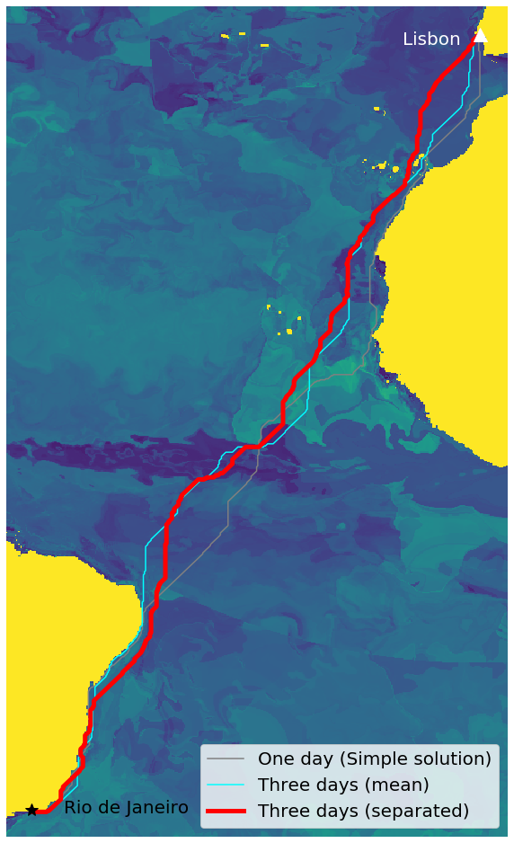

# Group Challenge: Comparison of a simple and an advanced routing solution
Contributors:

* Alba Vilanova Cortezón (https://github.com/albavilanova)
* Jannis Fröhlking (https://github.com/JaFro96)
* Jonathan Bahlmann (https://github.com/jonathom)

In the light of the ongoing R&D project “MariData”, our goal was to build two routing solutions for ships that reduces their energy consumption. For this, we use variables describing the ocean state to model speed over ground (SOG). We then predict SOG based on live forecast data of these ocean variables to find a route that has the highest possible speed, and thus the best conditions for a ship to save fuel. The two routing solutions are a) a simple solution to approach the problem and b) an advanced solution, describing a functional routing system.

To execute the comparison follow these steps:

### STEP 1: run `data_collection.ipynb` to collect CMEMS and AIS data (32 GB space required!)
  * AIS and CMEMS data for the model on:
    * 01.01.2020
    * 01.04.2020
    * 01.07.2020
    * 01.10.2020

  * CMEMS data for the routing on:
    * 01.06.2021
    * 02.06.2021
    * 03.06.2021

[CMEMS data source](https://resources.marine.copernicus.eu/?option=com_csw&task=results)

### STEP 2: run `model_building.ipynb` to build the model and compare the routes

## Comparison of Simple and Advanced Routing

|parameter|simple routing (single day)|advanced routing (multiple days)|
---| --- | ---
| methods | linear model, single ocean variables and combined ocean variables, considering a single day of forecast weather data | random forest model, ocean variables combined, considering multiple (3) days of forecast weather data |
|constraints| assuming constant speed, calculated cost does not refer to the actual cost but to the possible speed, linear model doesn't fit data well. Does not consider weather changes along the route | assuming constant speed, calculated cost does not refer to the actual cost but to the possible speed, "radius" technique of updating the routing raster to combine timesteps only possible under strong assumptions, including more forecast days means much more data storage needed |
|energy demand| most energy needed for preprocessing, storing needs acceptable (~3GB) | most energy needed for preprocessing, needs much storing capacity for weather forecasts (>10GB) |
|applicability| for short routes with little margin for maneuver. single variables have huge differences in indications for routing between them -> should really always be combined. combined variables show ok results | confident routing for complicated and long routes, route planning. shows that updating weather data is much different from combining forecast days (e.g. by mean) |
| potential | By leaning into the "simple and lightweight" approach, this system could be useful for e.g. planning day-long boat trips  | This system has the potential to be useful in real cargoship routing. With a) real seakeeping and fuel consumption data and b) a real 3D routing algorithm that works on multiple timesteps under the applicable constraints, a useful system for long distance ocean routing could be made  |

## Cost comparison (rounded)

| One day (RF)| All days mean (RF)| All days splitted (RF)|
| ----------- | ----------- | ----------- |
| 1 | 1.06 | 0.95 |

-> splitting the route is 5% faster than considering just one day, however this comparison of total costs is fuzzy

### References
* https://levelup.gitconnected.com/dijkstras-shortest-path-algorithm-in-a-grid-eb505eb3a290
